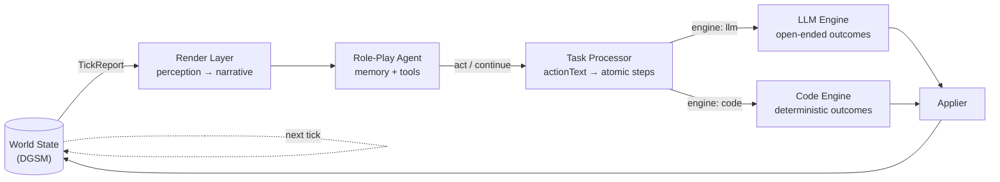

# LLM World Engine

> A tick-based world simulation where every NPC is an LLM agent with memory,
> perception, and goals — inspired by the open-endedness of tabletop RPGs.

```
        World state ──▶ Render Layer ──▶ Role-Play Agent ──▶ Task Processor
              ▲                                                     │
              └─────────  Code Engine  ◀──┴──▶  LLM Engine  ◀───────┘
                              (deterministic)      (open-ended)
```

A traditional game engine updates the world deterministically when events
fire. **An LLM world engine adds a second engine** that can handle
open-ended state changes — characters disassembling items, reshaping scenes,
having social interactions whose outcome depends on context. The two engines
run side by side, fed by a task processor that routes each atomic step to
whichever engine is right for the job.

This repository is a working implementation of that idea.

---

## Why I built this

A TTRPG session, when you watch it carefully, is the act of *re-creating
a world*. Players input actions; the world changes according to rules,
environment, and events; NPCs react out of memory, relationships, and
goals; scenes, items, weather, and storylines keep evolving. That made me
ask: if a TTRPG is already a dynamic world, could I build a **game engine
driven by LLMs**?

A traditional engine is great at the deterministic core — math, physics,
time, probability. It is not great at "the player just used the lamp oil
to bribe the watchman, taking advantage of the rain." LLMs are the
opposite. So the engine is a **hybrid**:

- **Code engine** — deterministic outcomes (movement, time, weather,
  item damage, stamina).
- **LLM engine** — open-ended outcomes, constrained by per-skill schemas
  so the result is still typed state changes.
- **Task processor** — interprets free-form action text into atomic
  steps and routes each to the right engine.

One engine brings determinism, the other open-endedness; one brings
efficiency, the other imagination. The skill layer itself borrows a
pattern from Claude Code's Skill mechanism: every action category
(electrical repair, driving, diving, climbing, investigation, social,
combat…) declares what world state to read, what rules to honor, what it
can change, and how the result writes back.

Once the engine ran, the harder question was: **how does a character
actually live inside this world?** An LLM is a blank super-brain. Give
it a name, age, profession, history, personality, goal, and secret and
it starts behaving like a *character*. But what shapes a person's
behavior isn't the profile — it's the **memory**. So every NPC has
short-term and long-term memory, a known-map of places, a relationship
graph, and a forgetting curve. Recall is fuzzy on purpose: humans
forget, misremember, and remember selectively too.

And then: **how does the character perceive the world?** Not by reading
the structured state. The way you read a paper — inline citations plus
a reference block. The **render layer** does that, in words instead of
pixels. If a 2D / 3D engine is wired in later, the same seam becomes
"render a frame, attach it to the prompt, the NPC sees multimodally."

The three pieces — hybrid engine, role-play agent, render layer — close
the loop: world state → perception → decision → action → state.

---

## Design decisions I'd point at

Four choices in this codebase that I thought about hard and want a
reader to notice:

- **Hybrid LLM / code engine routing.** Every `ActionStep` declares
  `engine: "llm"` or `engine: "code"`. Open-ended outcomes (item
  disassembly, social interaction, ambiguous reasoning) go to the LLM,
  constrained by per-skill schemas. Deterministic outcomes (movement,
  time, weather, math) go to code. Probability and rules to code;
  narrative and semantics to the model. One queue, one applier.
- **Citation contract.** A single `[Name]` syntax in `actionText`
  carries through renderer → agent → interpreter → engine, replacing
  parallel `targetCharacterIds` fields. Characters, items, and scenes
  share one surface; the format aligns with how LLMs were pre-trained
  to read references; persisted memories stay self-describing.
- **Render-as-perception.** The render layer turns world state into the
  words the NPC would perceive — first person, sensory only,
  citation-annotated. Wire in a 2D / 3D engine later and the same seam
  becomes "render a frame, attach it to the prompt, the NPC perceives
  multimodally."
- **Memory shaped like a human's, not a database's.** Seven memory
  types with a decay curve, embedding-based recall, a daily
  summarization pass. Retrieval is fuzzy *by design* — people forget,
  misremember, and selectively recall. An NPC that remembers perfectly
  stops feeling like a person.

---

## How it works



Each tick is one in-world minute (configurable). One round trip per tick:

1. The engine emits a `TickReport`.
2. The controller picks the NPCs that need to act this tick — those whose
   action ended, those affected by propagated events, and idle alive NPCs.
3. The render layer turns each NPC's perceivable slice of the world into a
   first-person narrative.
4. The agent runs a short tool loop and returns one decision.
5. `act` flows through the task processor, lands in the engine queue, and
   the next tick consumes it.

There is no central scheduler. The pipeline is one-way:
**NPC AI → translation → queue → engine.**

---

## Citations: how actions pick their targets

In academic writing, you cite works inline by marker and define them in a
reference block. The same pattern threads through this engine — and not
by accident.

### The contract

**Renderer → Agent.** The perception narrative cites named entities
inline as `[N]`, with a `[references]` block listing each one. The agent
reads the narrative the way you read a paper:

```
[narrative]
I step into the lantern light spilling from the doorway. Smith[1] is
hunched at the table, turning over the bound ledger[2] in his hands.

[references]
[1] Smith: gaunt, soot-stained coat
[2] the bound ledger: thick leather, brass clasp
```

**Agent → Engine.** When the agent acts it calls the single structured
`act` tool — intent only, never outcomes:

```jsonc
act({
  "description": "I kneel at the cabinet and work the lock with my picks.",
  "objectRefs": [
    { "kind": "item", "id": "cabinet_lock", "role": "target" },
    { "kind": "item", "id": "ITEM_SCN2_7", "role": "tool" }
  ],
  "proposedDurationTicks": 3,
  "skillId": "Locksmith"        // optional; utterance? carries exact speech
})
```

**Trusted Action Intake.** The controller validates every ref against the
actor's per-tick perceivable directory, stamps the trusted envelope
(commandId / actorId / issuedAt / issuedSceneId / replacesActionId — the
model can forge none of them), and if a skill was declared rolls it
IMMEDIATELY from the real character value into an immutable
`SkillRollRecord`. The result is an `ActionCommand` — the single action
boundary between RoleSim and the Engine.

**Engine resolution.** Commands queue in the Engine's inbox. On a tick with
a resolution trigger (new command, an active action reaching its
`nextWakeAt`, a replacement, or an interruption) the Engine builds ONE
full-world `EngineResolutionContext` and runs ONE World Action Engine
session for ALL new and in-flight actions together. The session may call
deterministic code tools (pathfinding, movement cost, inventory
validation, opposed roll, damage dice) and must submit a single
`TickResolution`: per-action transitions with Engine-owned
`resolvedDurationTicks` + timing reasons, sourced `WorldDelta`s grouped by
character/scene/item, and objective `Occurrence`s with perceiver character
ids. A code validator enforces references, invariants, single transitions
and roll consistency; one corrective retry, then invalid output is dropped
and the affected actions fail. Idle clock ticks make ZERO model calls —
deterministic subsystems (movement interpolation, weather, fire, stamina)
still advance.

**Per-character rendering.** Occurrences route to each listed perceiver;
the Renderer combines them with that character's own state to decide what
they actually perceive (sight vs sound-only per signals, unknown identities
by description) and produces the first-person narrative the agent reads.
Subjective event/witness memories are written from this rendered
perception — never from god-eye engine text.

---

## The three pillars

### 1. The Hybrid World Engine — `src/engine/`

The engine is the source of truth for world state. One `tick()` advances
every in-flight action, runs passive systems, fires scripted/emergent
events, applies state changes, and emits a `TickReport`. The `Applier` is
the only writer to world state.

**Composition** (`core/tickEngine.ts`):

| Component              | Role                                                                  |
| ---------------------- | --------------------------------------------------------------------- |
| `CommandInbox`         | Pending `ActionCommand`s between submit and first resolution          |
| `ActionStore`          | Persisted `EngineAction` lifecycle (idempotent per commandId)         |
| `WorldActionEngine`    | One global semantic resolution session per triggered tick             |
| `worldDeltaValidator`  | Code-side contract enforcement + finalization                         |
| `CodeToolRegistry`     | Deterministic capabilities (pathfinding, rolls, inventory…), audited  |
| `movementRuntime`      | Per-tick deterministic route execution on `EngineAction.runtime`      |
| `ScriptedEventRunner`  | Module-defined events that match on world state                       |
| `Applier`              | Sole writer to `DynamicGameStateManager`; consumes WorldDeltas natively |
| `TickOrchestrator`     | Drives the tick phases and assembles `TickReport`                     |

**One rule set, no action types:** there are no per-action definitions and
no natural-language interpreter. Every open-ended or composite action is
resolved under the single rule document
`src/engine/rules/world-action-resolution.md` (causality, state
constraints, locality, engine-owned timing, conservation, roll-first
assessment, concurrency consistency, minimal change, fact/perception
separation, action-driven triggering) and one `WorldDelta` schema.

---

### 2. The Role-Play Agent — `src/roleSim/`

A bare LLM is a blank super-brain. Give it a name, age, profession,
history, personality, goal, and secret, and it becomes a *character*. But
what really shapes a person's behavior is **memory** — and that is what
turns the character into a continuing one.

**Memory** (`src/memory/`) — seven types of memory plus a decay engine, a
known-map memory, an embedding-based retriever (FastEmbed), and a daily
summarization pass (`roleSim/dailySummarization.ts`). Recall is fuzzy by
design: humans forget, misremember, and rationalize too.

**`LLMRoleSimAgent.decideNext(ctx)`** — a bounded agent loop (≤14
iterations per call):

1. Build the prompt from the full `RoleSimContext` (profile, current scene,
   current action, recent memory, long-term intent, the rendered
   `perception.narrative`) plus the running tool transcript.
2. One `generateText` round-trip on `ModelClass.MEDIUM` returns one JSON
   tool call.
3. Dispatch:
   - **Terminal tools** (`act`, `continue`) end the loop and return a
     decision to the controller.
   - **Instant tools** (`writeMemory`, `recallMemory`, `getMapSnapshot`)
     execute synchronously, append `→ Called` / `← Result` to the
     transcript, and the loop continues.
4. Per-tool budgets cap re-entry; the iteration cap is a hard fallback that
   forces `continue`.

The agent never sees engine handles or in-flight queue state. The engine is
the source of truth; the controller queries it on demand.

**`NpcActionController`** subscribes to one channel — `tickCompleted` —
and per tick computes the NPCs that need a `decide()` call:

1. Impact propagation via `findAffectedCharacters` for any in-flight action
   that overlaps a `FeatureEvent`.
2. NPCs whose action ended this tick (commit / interrupt / cancel).
3. Alive NPCs with no in-flight step.

Each affected NPC gets exactly one `decide()` per tick.

**Tool surface:**

| Tool             | Kind     | Effect                                                       |
| ---------------- | -------- | ------------------------------------------------------------ |
| `act`            | terminal | Submitted to the engine via `ActionIntake`                   |
| `continue`       | terminal | Keep doing the in-flight action; no submission               |
| `writeMemory`    | instant  | Append a typed memory through `NpcMemoryManager`             |
| `recallMemory`   | instant  | Retrieve memory by query/type/date with embedding rerank     |
| `getMapSnapshot` | instant  | Read-only view of the NPC's known topology                   |

---

### 3. The Render Layer — `src/roleSim/renderer/`

In a traditional engine, the renderer turns world state into pixels. In an
LLM world, it turns world state into **the words the NPC perceives** — the
NPC's camera. Same role, different output.

The agent never reads the structured world. It reads what its character
*could see, hear, smell, and feel right now*. That is what the render layer
produces.

**`buildPerceivedBundle`** gathers the per-NPC slice:

- `scene` — id, name, description, active scene conditions
- `ownConditions` — the NPC's own character conditions (proprioceptive)
- `ownAction` — `ongoing` / `ended { committed | interrupted | cancelled }` /
  `idle`
- `events` — the controller-filtered `FeatureEvent`s that propagated to
  this NPC

**`render`** runs one LLM round-trip on `ModelClass.SMALL` (Haiku-tier).
The system prompt enforces:

- **Format** — a `[narrative]` paragraph (first person, present tense,
  sensory only) followed by a `[references]` block.
- **Perception only** — render only what the viewpoint can sense right
  now. No memory, no plot secrets, no hidden allegiances, no future plans.
- **Citations** — `[N]` after named people, items, and scenes the first
  time they appear; reuse the same `N` thereafter. Sub-locations, weather,
  and generic nouns stay inline as plain prose.
- **Identity** — for unknown people, use the description-based identifier
  given in the input (`"the gaunt man"`); never invent canonical names.

If the LLM call fails or returns empty, `render` falls back to
`buildGodEyeFallback` — a deterministic, synchronous god-eye prose render
of the same bundle. Tests exercise the deterministic path directly via
`renderFallback`.

If a 2D / 3D engine is wired in later, the render layer is the natural
seam: replace the textual narrative with rendered pixels and feed both into
a multimodal prompt.

---

## Tick = frame rate

The world advances one tick at a time. A tick can be one in-world minute,
five, or longer.

In a traditional game, frame rate is bounded by how fast you can rasterize
triangles. In an LLM world, the bound is **how fast the engines and the
agents can think** — state-update throughput, inference latency, token
generation speed. The faster the two engines and the agent loop run, the
shorter each tick can be, and the smoother the world flows.

GPUs once raced to draw triangles. In an LLM world, token throughput
becomes its own kind of rendering budget.

---

## Quick start

Prerequisites: **Node ≥ 18**, **pnpm** (enforced via `only-allow`),
**PostgreSQL**, and an LLM API key (Anthropic / OpenAI / Google) configured
via env vars.

```bash
pnpm install                # also runs prisma generate
pnpm prisma db push         # use db push, not migrate dev (see Notes)
pnpm chat:dev               # API + WebSocket server + Vite frontend
```

Other useful commands:

```bash
pnpm chat                   # backend only
pnpm chat:frontend          # frontend only
pnpm build                  # swc src -> dist
pnpm build:tsc              # tsc -p tsconfig.json
pnpm check                  # biome check --apply
pnpm test                   # vitest (-- path/to/file or -t name to filter)
```

Path alias `@/*` → `src/*` is configured for vitest.

---

## Repo layout

```text
src/
  engine/      Tick engine: actions, resolution, tools, subsystems, rules
  roleSim/     Role-play agent, controller, render layer, tool dispatcher
  simulation/  SimulationRunner, persistence, event emitter
  state/       DynamicGameState, topology, gameClock, module loading
  memory/      7-type NPC memory + decay + retriever
  models/      LLM wrapper (ChatAnthropic / OpenAI / Google)
  rag/         Discovery retrieval
  i18n/        en / zh

client/
  server/      Express + WebSocket entry and route modules
  src/         React + Vite + Tailwind admin UI

prisma/
  schema.prisma
  migrations/
```

---

## Notes

- Use `pnpm prisma db push` rather than `migrate dev`. The
  `reminder_embeddings` table has drift that makes `migrate dev` unsafe.
  Scenarios use a compound unique key `(moduleId, scenarioId)`; query with
  `findFirst`, not `findUnique`.
- A single `gameDateTime` ISO 8601 string is the only time field. New code
  must not split it back into separate day/time fields. See
  `src/state/gameClock.ts`.
- `CLAUDE.md` is the canonical developer reference for contributors.
- Legacy single-player chat, turn polling, and memo paths have been
  removed; only the simulation surface is active.

---

> Bring GPUs back to games. **Make Games Great Again.**
