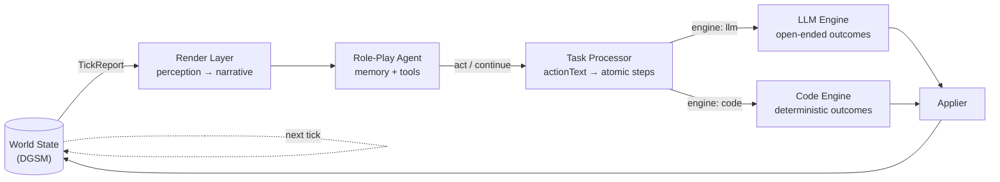

# LLM World Engine

> A tick-based world simulation where every NPC is an LLM agent with memory,
> perception, and goals — inspired by the open-endedness of tabletop RPGs.

```
        World state ──▶ Render Layer ──▶ Role-Play Agent ──▶ Task Processor
              ▲                                                     │
              └─────────  Code Engine  ◀──┴──▶  LLM Engine  ◀───────┘
                              (deterministic)      (open-ended)
```

A traditional game engine updates the world deterministically when events
fire. **An LLM world engine adds a second engine** that can handle
open-ended state changes — characters disassembling items, reshaping scenes,
having social interactions whose outcome depends on context. The two engines
run side by side, fed by a task processor that routes each atomic step to
whichever engine is right for the job.

This repository is a working implementation of that idea.

---

## Why this exists

A TTRPG session is, in essence, the act of *re-creating a world*. Players
input actions, the world changes according to rules, environment, and
events; NPCs react out of memory, relationships, and goals; scenes, items,
weather, time, and storylines keep evolving. That made me wonder: if a
TTRPG is already a dynamic world, can we build a **game engine driven by
LLMs**?

Traditional engines are great at the deterministic core — math, physics,
probability, time. They are not great at "the player just used the lamp oil
to bribe the watchman, taking advantage of the rain." So this project
combines them:

- **Code engine** — deterministic outcomes (movement, time, weather, item
  damage, stamina).
- **LLM engine** — open-ended outcomes, constrained by per-skill schemas so
  the result is still typed state changes.
- **Task processor** — interprets free-form action text into atomic steps
  and routes each to the right engine.

The result is a world that can be both efficient and imaginative.

---

## How it works



Each tick is one in-world minute (configurable). One round trip per tick:

1. The engine emits a `TickReport`.
2. The controller picks the NPCs that need to act this tick — those whose
   action ended, those affected by propagated events, and idle alive NPCs.
3. The render layer turns each NPC's perceivable slice of the world into a
   first-person narrative.
4. The agent runs a short tool loop and returns one decision.
5. `act` flows through the task processor, lands in the engine queue, and
   the next tick consumes it.

There is no central scheduler. The pipeline is one-way:
**NPC AI → translation → queue → engine.**

---

## Citations: how actions pick their targets

In academic writing, you cite works inline by marker and define them in a
reference block. The same pattern threads through this engine — and not
by accident.

### The contract

**Renderer → Agent.** The perception narrative cites named entities
inline as `[N]`, with a `[references]` block listing each one. The agent
reads the narrative the way you read a paper:

```
[narrative]
I step into the lantern light spilling from the doorway. Smith[1] is
hunched at the table, turning over the bound ledger[2] in his hands.

[references]
[1] Smith: gaunt, soot-stained coat
[2] the bound ledger: thick leather, brass clasp
```

**Agent → Engine.** When the agent acts, it cites entities in
`actionText` by name in square brackets — drawn verbatim from the
reference block it just read:

```
"ask [Smith] about [the bound ledger]"
"approach [the gaunt man]"
"hand [the bound ledger] to [Helen Park]"
```

**Engine resolution.** The `GameInterpreter` builds a per-actor
*perceivable directory* — KNOWN people from the actor's relationship
graph, plus UNKNOWN people / items / scenes currently in view — and
resolves each `[Name]` to a typed `{ id, kind }` reference. The action's
`referencedEntities` field becomes the single source of truth for "who
or what this action is about." There is no parallel `targetCharacterIds`
list to drift.

### Why this format

Several reasons converge:

1. **Renderer output is a 1:1 mirror of a paper.** Inline `[N]` plus a
   reference block is one of the most heavily attested structures in LLM
   pretraining (arXiv, PubMed, Wikipedia). The model is fluent at
   producing it without being taught.
2. **`[Name]` in `actionText` is wiki / footnote–flavored** — also a
   high-prior pattern (Wikipedia internal links, markdown footnotes,
   legal citations). Brackets around a token are an unambiguous "this is
   a named referent" signal the model has seen millions of times.
3. **It composes with prose.** JSON or XML target fields would split the
   narrative; brackets stay readable inline and survive being written to
   memory — `"ask [Smith] about [the letter]"` is self-describing even
   out of context.
4. **Format gives the prior; strict naming gives the precision.** The
   contract requires verbatim names from the reference block — no
   abbreviations, no aliases. Brackets make the model good at this; the
   naming rule makes it exact.

The result is a symmetric, low-ambiguity contract: characters, items,
and scenes all use the same citation surface, every layer reads the same
text, and `actionText` alone tells you what the action is and who it's
against.

---

## The three pillars

### 1. The Hybrid World Engine — `src/engine/`

The engine is the source of truth for world state. One `tick()` advances
every in-flight action, runs passive systems, fires scripted/emergent
events, applies state changes, and emits a `TickReport`. The `Applier` is
the only writer to world state.

**Composition** (`core/tickEngine.ts`):

| Component              | Role                                                                  |
| ---------------------- | --------------------------------------------------------------------- |
| `Queue`                | Global ordered list of `ActionStep`s, indexed by actor                |
| `ActionIntake`         | Accepts `ActionInput`, calls the interpreter, enqueues steps          |
| `FeatureRunner`        | Per-tick passive systems (`weather`, `sun`, `fire`, `itemDamage`, `stamina`) |
| `ScriptedEventRunner`  | Module-defined events that match on world state                       |
| `EmergentEventEmitter` | Pluggable scanners (e.g. `EncounterScanner`)                          |
| `Applier`              | Sole writer to `DynamicGameStateManager`                              |
| `TickOrchestrator`     | Drives the per-tick phases and assembles `TickReport`                 |

**Two execution paths per `ActionStep`:**

- `engine: "llm"` — `stateResolver` (`resolver/stateResolver.ts`) makes one
  LLM call, constrained by the action's `outputSchema`, and returns typed
  `StateChange`s plus a planned duration.
- `engine: "code"` — dispatched through `codeEngineRegistry` to a
  deterministic subsystem. The current default is `movement`
  (path-following across junctions and roads). Custom subsystems register
  here.

**Natural-language translation:** `gameInterpreter`
(`interpreter/gameInterpreter.ts`) takes free-form `actionText` plus the
registered `ActionDefinition`s and produces typed `InterpretedStep[]`.
Skill-check definitions are split into opposed/single, `[Name]` citations
are resolved against the entity directory, and impact hints flow through to
downstream propagation.

**Skills as the contract:** every action type is described by an
`ActionDefinition` declaring which world state to read, which rules to
honor, what the LLM is allowed to change, and what the typed output looks
like. Adding a new domain (electrical repair, diving, social maneuver…) is
a matter of writing a definition.

---

### 2. The Role-Play Agent — `src/roleSim/`

A bare LLM is a blank super-brain. Give it a name, age, profession,
history, personality, goal, and secret, and it becomes a *character*. But
what really shapes a person's behavior is **memory** — and that is what
turns the character into a continuing one.

**Memory** (`src/memory/`) — seven types of memory plus a decay engine, a
known-map memory, an embedding-based retriever (FastEmbed), and a daily
summarization pass (`roleSim/dailySummarization.ts`). Recall is fuzzy by
design: humans forget, misremember, and rationalize too.

**`LLMRoleSimAgent.decideNext(ctx)`** — a bounded agent loop (≤14
iterations per call):

1. Build the prompt from the full `RoleSimContext` (profile, current scene,
   current action, recent memory, long-term intent, the rendered
   `perception.narrative`) plus the running tool transcript.
2. One `generateText` round-trip on `ModelClass.MEDIUM` returns one JSON
   tool call.
3. Dispatch:
   - **Terminal tools** (`act`, `continue`) end the loop and return a
     decision to the controller.
   - **Instant tools** (`writeMemory`, `recallMemory`, `getMapSnapshot`)
     execute synchronously, append `→ Called` / `← Result` to the
     transcript, and the loop continues.
4. Per-tool budgets cap re-entry; the iteration cap is a hard fallback that
   forces `continue`.

The agent never sees engine handles or in-flight queue state. The engine is
the source of truth; the controller queries it on demand.

**`NpcActionController`** subscribes to one channel — `tickCompleted` —
and per tick computes the NPCs that need a `decide()` call:

1. Impact propagation via `findAffectedCharacters` for any in-flight action
   that overlaps a `FeatureEvent`.
2. NPCs whose action ended this tick (commit / interrupt / cancel).
3. Alive NPCs with no in-flight step.

Each affected NPC gets exactly one `decide()` per tick.

**Tool surface:**

| Tool             | Kind     | Effect                                                       |
| ---------------- | -------- | ------------------------------------------------------------ |
| `act`            | terminal | Submitted to the engine via `ActionIntake`                   |
| `continue`       | terminal | Keep doing the in-flight action; no submission               |
| `writeMemory`    | instant  | Append a typed memory through `NpcMemoryManager`             |
| `recallMemory`   | instant  | Retrieve memory by query/type/date with embedding rerank     |
| `getMapSnapshot` | instant  | Read-only view of the NPC's known topology                   |

---

### 3. The Render Layer — `src/roleSim/renderer/`

In a traditional engine, the renderer turns world state into pixels. In an
LLM world, it turns world state into **the words the NPC perceives** — the
NPC's camera. Same role, different output.

The agent never reads the structured world. It reads what its character
*could see, hear, smell, and feel right now*. That is what the render layer
produces.

**`buildPerceivedBundle`** gathers the per-NPC slice:

- `scene` — id, name, description, active scene conditions
- `ownConditions` — the NPC's own character conditions (proprioceptive)
- `ownAction` — `ongoing` / `ended { committed | interrupted | cancelled }` /
  `idle`
- `events` — the controller-filtered `FeatureEvent`s that propagated to
  this NPC

**`render`** runs one LLM round-trip on `ModelClass.SMALL` (Haiku-tier).
The system prompt enforces:

- **Format** — a `[narrative]` paragraph (first person, present tense,
  sensory only) followed by a `[references]` block.
- **Perception only** — render only what the viewpoint can sense right
  now. No memory, no plot secrets, no hidden allegiances, no future plans.
- **Citations** — `[N]` after named people, items, and scenes the first
  time they appear; reuse the same `N` thereafter. Sub-locations, weather,
  and generic nouns stay inline as plain prose.
- **Identity** — for unknown people, use the description-based identifier
  given in the input (`"the gaunt man"`); never invent canonical names.

If the LLM call fails or returns empty, `render` falls back to
`buildGodEyeFallback` — a deterministic, synchronous god-eye prose render
of the same bundle. Tests exercise the deterministic path directly via
`renderFallback`.

If a 2D / 3D engine is wired in later, the render layer is the natural
seam: replace the textual narrative with rendered pixels and feed both into
a multimodal prompt.

---

## Tick = frame rate

The world advances one tick at a time. A tick can be one in-world minute,
five, or longer.

In a traditional game, frame rate is bounded by how fast you can rasterize
triangles. In an LLM world, the bound is **how fast the engines and the
agents can think** — state-update throughput, inference latency, token
generation speed. The faster the two engines and the agent loop run, the
shorter each tick can be, and the smoother the world flows.

GPUs once raced to draw triangles. In an LLM world, token throughput
becomes its own kind of rendering budget.

---

## Quick start

Prerequisites: **Node ≥ 18**, **pnpm** (enforced via `only-allow`),
**PostgreSQL**, and an LLM API key (Anthropic / OpenAI / Google) configured
via env vars.

```bash
pnpm install                # also runs prisma generate
pnpm prisma db push         # use db push, not migrate dev (see Notes)
pnpm chat:dev               # API + WebSocket server + Vite frontend
```

Other useful commands:

```bash
pnpm chat                   # backend only
pnpm chat:frontend          # frontend only
pnpm build                  # swc src -> dist
pnpm build:tsc              # tsc -p tsconfig.json
pnpm check                  # biome check --apply
pnpm test                   # vitest (-- path/to/file or -t name to filter)
```

Path alias `@/*` → `src/*` is configured for vitest.

---

## Repo layout

```text
src/
  engine/      Tick engine, handlers, features, interpreter, resolver, codeEngine
  roleSim/     Role-play agent, controller, render layer, tool dispatcher
  simulation/  SimulationRunner, persistence, event emitter
  state/       DynamicGameState, topology, gameClock, module loading
  memory/      7-type NPC memory + decay + retriever
  models/      LLM wrapper (ChatAnthropic / OpenAI / Google)
  rag/         Discovery retrieval
  i18n/        en / zh

client/
  server/      Express + WebSocket entry and route modules
  src/         React + Vite + Tailwind admin UI

prisma/
  schema.prisma
  migrations/
```

---

## Notes

- Use `pnpm prisma db push` rather than `migrate dev`. The
  `reminder_embeddings` table has drift that makes `migrate dev` unsafe.
  Scenarios use a compound unique key `(moduleId, scenarioId)`; query with
  `findFirst`, not `findUnique`.
- A single `gameDateTime` ISO 8601 string is the only time field. New code
  must not split it back into separate day/time fields. See
  `src/state/gameClock.ts`.
- `CLAUDE.md` is the canonical developer reference for contributors.
- Legacy single-player chat, turn polling, and memo paths have been
  removed; only the simulation surface is active.

---

> Bring GPUs back to games. **Make Games Great Again.**
