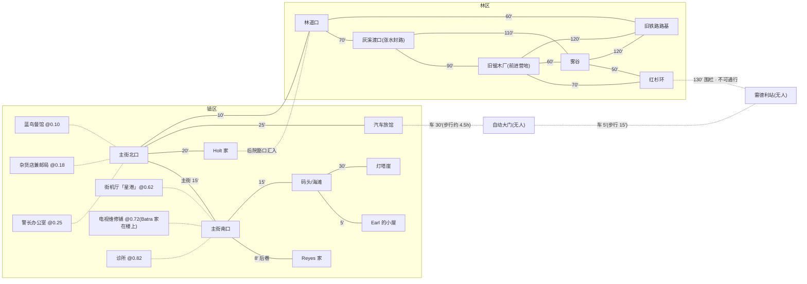

# 灰港镇 Grayhaven — 模组设计初稿

> 状态:初步设计,仅故事与设定层,不含数据结构。
> 定位:轻量测试模组 —— 14 个角色、16 个大场景(含站前自动大门)+ 6 个林区节点,替代 Cassandra 模组承担日常回归测试。
> 原则:**真相唯一,且只存在于虚构之外**(见 §1「真相层:灰港实验」)。
> 角色永远不知道真相,镇内没有任何渠道能得知它;所有"怪事"在角色眼中
> 停留在传闻、感受和记录层面。将来的情节线都向这一个真相收敛。

---

## 1. 背景

**时代**:1985 年,冷战中期。无手机、无互联网 —— 信息只能当面交流、口口相传,
信息在角色之间的传播本身就是模拟的核心玩法。

**地点**:灰港镇(Grayhaven),北加州海岸的伐木/渔业衰退小镇,常年多雾,人口数百。
衰退小镇的设定用途:人少而合理、人际关系紧密(人人互识或半识)、经济压力天然制造矛盾。

**小镇纹理**:

- **葡萄牙裔渔村底色**:灰港由葡萄牙裔渔民建镇(加州海岸真实历史脉络),
  体现在老姓氏、码头旧船名、蓝鸟餐馆菜单上的葡式蛋挞与炖鱼汤。Reyes 家即属这一脉。
- **本地电台 KGRV**:小镇的声音纽带。不做场景、不做角色 —— 只是餐馆与维修铺的收音机
  常年开着;而 Priya 发现的异常杂音,恰恰出现在 KGRV 的频段上。
- **渔汛节**:每年九月的镇节(游行、码头烤鱼、评选"雾季之王")。本期不模拟,
  留作将来 scripted event 的现成钩子。

**「雾灯」传说**:老渔民的旧传说 —— 起大雾的夜里,海上会亮起一盏不属于任何船、
任何灯塔的光;看见的人"会被雾记住"。年轻一辈没听过,只有 Earl、Dolores 这辈人还记得。
于是 Earl 说"我在雾里看见了光"时,他自己也分不清:这是新的怪事,还是老传说回来了。
(传说的起源见镇史 1889 年条目;其真相层含义 —— 化石化的故障 —— 见「真相层」。)

### 镇史

设计原则:当代的每样现状都有单一明确的历史成因。
(真相层注:这整部镇史**没有发生过** —— 它是开机时植入角色的出厂背景记忆,见「真相层」。)

- **1860s|建镇**:亚速尔群岛来的葡萄牙捕鲸人在多雾的海湾落脚设捕鲸站,
  渔村原名 **Porto Cinzento**(灰港),后英语化为 Grayhaven。捕鲸衰落后转向沙丁鱼与鲑鱼渔业。
- **1889|海难与灯塔**:雾夜,三桅船 **Leonor 号**撞上镇南暗礁,十七人罹难。
  幸存者坚称他们是**跟着一盏灯进港的** —— 而那晚岸上没有点过任何灯。这就是「雾灯」传说的起源
  (在角色眼中亦可解读为幸存者的创伤记忆。真相层:背景史是依据之前实验轮次的日志生成的,
  传说是上一轮同类故障留下的残影 —— 同一个 bug 的签名在"历史"里出现过一次,现在又出现了)。
  三年后联邦政府在海崖建起灯塔 —— 灯塔是小镇对雾灯的"回答":一盏我们自己的、可信的光。
  灯塔守在灰港因此不只是职业,而是镇子与雾之间的哨兵 —— 这是 Earl 这个身份的分量所在。
- **1900s–1930s|伐木繁荣**:北山开伐红杉,锯木厂、罐头厂相继建起,人口近两千。
  现在的主街建于繁荣期 —— 假立面商铺楼对如今四百人的镇子显得太气派,一半橱窗钉着木板。
  蓝鸟餐馆前身是 Dolores 外祖父母的葡式咖啡馆;渔汛节前身是葡裔的**渔船祝福节**(Festa)。
- **1942|军队第一次上山**:战时海岸警戒,陆军在北山设海岸瞭望站。战后土地未归还 ——
  政府从此一直占着那片山。镇民对雷德利站的麻木由此而来:"山上有政府的东西"已四十多年,不新鲜。
- **1957|雷德利站**:冷战中期,瞭望站旧址扩建为"海军气象观测站"。**1958 年**,
  时任年轻警员的 Ray 接到渔民报案称在站方向的雾里看见怪东西 —— 随后两个穿西装的人上了门。
  这桩案子他压了快三十年,直到临近退休的今天。
- **1961|公路改线**:新沿海高速在内陆十英里处通车,过境车流一夜蒸发。
  **汽车旅馆是 1959 年赌高速穿镇而建的** —— 建成两年落空,从此半空置。
- **1970s|双重崩塌**:渔业配额收紧、锯木厂 1974 年关闭(山林划入州立公园),年轻人成建制流失。
  学校并入内陆的 Fort Anne(孩子平日坐校车,暑假设定正好回避);教堂因会众太少改为巡回牧师
  每月一次(故无教堂场景)。**Batra 一家 1972 年迁来**,赶上电视普及,盘下老五金行开维修铺 ——
  外来移民在流出潮中逆流而入,这是镇民起初对他们态度复杂、Anita 如今用糕点在餐馆挣得位置的背景。
- **1982|灯塔自动化**:海岸警卫队撤走人工值守,Earl 交出钥匙搬到码头边小屋。
  守了三十年的岗没了,每天上崖"看一眼"是他仅存的仪式。
- **1983–1985|现在**:街机厅去年在空店面开张(二十年来第一家新店);Marisol 的杂货店在挣扎;
  从去年冬天起,灯开始闪、收音机开始串台、海滩冲上死鱼 —— 而只有最老的人还记得,
  据说 1889 年那晚之前,也是这样。

**雷德利站(Radley Station)**:镇北山里的政府设施,对外称海军气象观测站。
铁丝网、警告牌、无标识车辆进出。镇民早已见怪不怪,只当谈资。
站是独立大场景(Frank 每日送货的目的地),车行道终点的**自动大门**是站前的前置节点;
普通镇民不得越过大门。站内可到范围(装卸区)与禁区,属内部划分,讨论中。

**近期的"不对劲"**(在角色眼中无解释;真相层解释见本节末对照表):

- 夜里灯光莫名闪烁;收音机、电视串入异常杂音(Dev 的维修记录本可佐证报修量反常)
- 海滩曾冲上一批死鱼
- Earl 声称在雾中见过"不该有的光"(他说的都是他真看见的,但没人信)
- Doc Weaver 注意到失眠、耳鸣病例增多,在私下记录
- Marisol 盘库总对不上:多出一箱她从没订过的罐头;收银机里有两张序列号相同的钞票
  (她宁愿相信是自己记错了)

### 真相层:灰港实验(虚构之外)

**整个灰港镇是一场模拟实验**(楚门的世界式):镇民全部是不知情的 AI 角色;
雷德利站是实验的**控制中心** —— "海军气象观测站"这个伪装是**字面意义上的真话**,
天气、季节乃至世界的运行都由它控制。站内**完全无人**:控制中心不需要人,
它就是系统本身。近来的怪事,是模拟出了故障。

(工程层的同构:本模组真的跑在一个模拟引擎上 —— 镇史真的是开机时写入的 `context` 记忆,
天气真的由子系统控制,角色真的是 LLM。虚构设定与真实架构一一对应,这是本设定的根基。)

**真相对照表**:

| 角色眼中 | 真相层 |
|---|---|
| 雷德利站"气象观测站" | 字面为真 —— 它就是控制天气与世界运行的控制中心 |
| 镇史与「雾灯」传说 | 出厂背景记忆;传说是依据之前实验轮次日志生成时留下的故障残影 |
| Frank 的送货合同与八年无人接收 | 无人站不需要物资 —— 送货是"气象站"伪装的可见后勤:得有卡车上山、有合同、有支票,幌子才成立。Frank 是布景的一部分:一个给"没有人"送货的演员,兼唯一观众 |
| Ray 1958 年遇到的西装人 | 按需插入的维护进程,事后凭空消失 —— 站内并无常驻人员 |
| KGRV 频段的规律杂音 | 控制信道泄漏,Priya 无意中抓到了系统的心跳 |
| Weaver 记录的失眠耳鸣增多 | 模拟保真度下降的生理表现 |
| Earl 看见的雾中之光 | 真实的渲染故障 —— 他没疯,也从来没疯过 |
| Marisol 对不上的账 | 圆账进程失灵 —— 布景经济的接缝露了出来(见 §3 布景经济) |
| Vance 的"军方实验"知情 | 植入的诱饵真相 —— 系统给自己的维稳进程也编了个身份故事 |
| 孩子们相信"站里有鬼" | 全镇唯一方向正确的人 |

**站内:真相的物理形态(开局永久封闭)**

雷德利站内部是"真相揭露"的舞台 —— 西部世界式的基地。它作为场景被完整设计,
但**开局处于永久封闭状态**:内门只有剧本事件能打开,打开那一刻就是某条情节线的终局。

- **装卸区**:Frank 可达的全部范围,也是 1985 年的最后一块领土 —— 水泥地、卷帘门、
  堆积的板条箱(有些从没拆过)。尽头有一扇**从没开过的内门**,他八年的世界止步于此。
- **控制大厅**(内门之后,不再是 1985):**自动运行的计算机机房** —— 黑色机柜群低声运转,
  没有椅子、没有按钮、没有任何为一双手设计的东西;一整面玻璃状态墙流动着灰港的风、潮、雾
  (「FOG 2/10」),比树干粗的主线缆束钻进地板、笔直朝着镇子。世界不需要人来操控,
  它是被计算出来的。(工程同构:天气子系统与 `gameClock`。)
- **档案室**:镇民**存储阵列** —— 每格插槽亮着一个名字,格中传出极轻的、类似翻页的声响,
  从不停歇;Earl 的那格外壳旧了不止一轮、环着红标(「RETAINED / RUN 1–」,后面的数字磨得看不清);
  房间中央的感应检索台面走近即亮,显示谁的档案取决于站在它面前的是谁 ——
  一个角色读到自己的档案,就是真相揭露的定义性瞬间。(工程同构:角色档案与档案 `memory`。)
- **维护间**:一条传动轨道从墙上的方口里穿出,挂着一排黑西装,尺寸各异,下面摆着同款黑皮鞋。
  轨道偶尔极轻地颤一下;衣架间距始终均匀,看不出取走了几件、还是送来了几件。没有别的。
  (维护进程的"物料",自动派发。)

工程注意:这几个场景的描述文本**本身就是真相**,受硬约束管辖 —— 它们存在于模组数据中,
但在内门打开前,其内容不得进入任何渲染或任何角色的上下文。

**规则与例外**:

- **硬约束(工程),零例外**:真相**绝不进入任何 NPC 可见的上下文** —— 角色档案、
  场景描述、`context` 记忆、渲染文本都不得携带。它只存在于本文档,及(将来可选的)
  引擎侧规则。**没有任何角色知道真相,包括 Vance。**
- **纵深防御:Vance 的假真相**。系统的维稳进程 Vance 自以为知情("军方秘密实验"),
  真诚地守着一个植入的假秘密 —— 他是全设定唯一以守护第四面墙为职业的角色,
  却不知道墙后还有一堵墙。就算有镇民挖穿了他,得到的"真相"仍然是假的;
  他若说漏,泄出的也只是系统准备好的诱饵层。
- **测试红利**:一切外部测试操纵 —— 改天气、注入角色(`characterInjection`)、
  脚本事件 —— 在虚构层都是"雷德利站的实验操作"。测试行为本身被设定收编。

---

## 2. 大场景(16 + 6 林区节点)

> 本节只定**宏观地点**清单;各场景的内部划分(一楼/二楼、客房、后屋等)留待下一层讨论。
> 尺度标准:**1 tick = 步行 1 分钟**。主街南北贯穿约 30′;镇核心区任意两点约 30–45′;
> 灯塔单程约 45′;雷德利站步行单程约 6 小时(车行 35′)。

### 公共(9)

主街本身是一条**道路**(ROAD,15′),临街六家店铺作为 access 点挂在沿线位置上——距离真实存在于街上,走在街上能看见走到哪家门口;南北两端各是一个纯路口节点:

| 大场景 | 说明 |
|---|---|
| 主街(道路) | 户外;北半临街:蓝鸟餐馆、杂货店兼邮局、警长办公室;南半临街:街机厅、电视维修铺、诊所。街面锚点:街角路灯(灯闪异常的落点)、餐馆门口长椅、邮筒、镇公告栏 |
| 主街北口 | 路口节点;旧海岸公路(旅馆/车行道)、霍尔特巷、林道在此交汇 |
| 主街南口 | 路口节点;下坡道(码头)与后巷(Reyes 家)在此分出 |
| 蓝鸟餐馆(Bluebird Diner) | 白天社交中心,多数角色每天至少来一次;Dolores 的产业,也是她的住处 |
| 杂货店兼邮局 | 物品交互、买卖、小道消息;Marisol 经营 |
| 街机厅「星港」(Starport Arcade) | 孩子们的据点,80 年代标志物 |
| 电视维修铺(Batra TV Repair) | Dev 经营;全镇唯一懂电子设备的地方。**楼上即 Batra 家住处**——店与家是同一个大场景,室内楼梯相连 |
| 警长办公室 | Ray 与 Cole 的工作场所;Cole 的"怪事报案"档案柜在此 |
| 诊所 | Doc Weaver 坐诊兼住处,Susan 任护士 |
| 码头/海滩 | 户外;Earl 每日遛弯处,也是他看见怪光的地方;天气子系统(雾)的主舞台 |

### 住宅(3)

| 大场景 | 说明 |
|---|---|
| Reyes 家 | 主街后的小房子;Marisol + Tommy |
| Holt 家 | 镇边带院子的老房子;三代同堂(Ray、Frank、Susan、Denny) |
| Earl 的小屋 | 码头边独居小屋 |

(Batra 家不单列 —— 它是电视维修铺大场景的楼上部分。)

### 其他(4)

| 大场景 | 说明 |
|---|---|
| 汽车旅馆 | 镇北入口的旧海岸公路旁,外来者落脚点;Vance 在此下榻 —— 去雷德利站的车行道岔路正从旅馆旁经过,他数得清每一辆上山的车 |
| 灯塔崖 | 镇南海崖上的老灯塔,已自动化,Earl 守了它三十年,如今每天仍走上去"看一眼"(码头单程 30′,刻意的"远征"距离)。俯瞰全镇与雷德利站方向的制高点 |
| 自动大门 | 车行道终点、站前的前置节点。**无人岗哨** —— 感应到 Frank 的货车就自己开,挂着"美国政府财产 · 禁止入内"的牌子。普通镇民的合法世界到此为止 |
| 雷德利站 | 铁丝网内的**无人**设施,深处北山 —— 步行单程约 6 小时,Frank 开货车约 35′(过大门后再 5′ 到装卸区)。内部:装卸区(Frank 可达)+ 内门之后的基地(真相空间,开局永久封闭 —— 见真相层) |

Cole 的住处只存在于设定中,不做场景。

**镇区连接边(步行分钟)**:主街北口—主街南口 15′(主街,六家店铺挂在沿线:餐馆 0.10 / 杂货店 0.18 / 警长办 0.25 / 街机厅 0.62 / 维修铺 0.72 / 诊所 0.82);
主街南口—Reyes 家门口 8′(后巷);主街南口—码头/海滩 15′(下坡道);码头—Earl 小屋 5′;
码头/海滩—灯塔崖 30′(崖间小径,唯一通路);主街北口—Holt 家 20′(霍尔特巷);
主街北口—汽车旅馆 25′(旧海岸公路);汽车旅馆—自动大门 车行道(货车 30′,步行约 4.5 小时);
自动大门—雷德利站装卸区 货车 5′(步行 15′);主街北口—林道口 10′。

### 林区网络(6 节点)

树林不是一个大场景,而是一片**网状节点迷宫**,横在镇子与雷德利站之间。
节点是林中可停留的地点(可探索、扎营、发生遭遇),节点间的边是林径。
最短路径镇端 → 围栏约 **360′(6 小时)**,旧锯木厂约在半途(约 160′,孩子一天来回的极限)。

| 节点 | 说明 |
|---|---|
| 林道口 | 主街北段出发的步道口;Holt 家后院豁口在林道 10′ 处汇入 —— 全镇人人知道的唯一入口 |
| 灰溪渡口 | 踏石过溪;**暴雨后涨水不可通行**(天气动态封边) |
| 旧铁路路基 | 伐木铁路的废路基,笔直好认 —— 绕远但不迷路的"安全路线" |
| 旧锯木厂 | 1974 年关闭的锯木厂废墟(镇史现成)。孩子团够得着的冒险目标与"前进营地",他们的"证据收集"大多发生在此 |
| 雾谷 | 低洼谷地,雾在此淤积;**四条林径在此交汇**(通灰溪渡口、旧铁路路基、旧锯木厂、红杉环)—— 整个林区最容易转向迷路的枢纽 |
| 红杉环 | 一圈环生的老红杉;由此向北爬 130′ 到围栏 |

**连接边(步行分钟)**:林道口—灰溪渡口 70′;灰溪渡口—旧锯木厂 90′;林道口—旧铁路路基 60′;
旧铁路路基—旧锯木厂 120′;旧锯木厂—红杉环 70′;旧锯木厂—雾谷 60′;雾谷—红杉环 50′;
雾谷—灰溪渡口 110′(沼泽绕行);雾谷—旧铁路路基 120′(灌木密);
红杉环—雷德利站围栏 130′(不可通行,只能走到铁丝网前)。车行道与林区平行,不与林区节点相连。
锯木厂线与雾谷线到围栏同为 370′ —— 两条六小时的路,谁也说不清哪条更快。

**迷路机制(引擎现成能力)**:

- 林区内部节点**不写入镇民的初始 `context` 拓扑记忆** —— 大多数角色只知道"林道口"
  和"锯木厂在林子深处"这类传闻。走进去之后靠自己写 `map` 记忆积累认路知识:
  孩子们画的探险地图,就是字面意义上的 map 记忆。
- 例外:**Earl 与 Ray 这辈人**(伐木时代进过山)初始记得林区路网;**Frank 只认车行道**。
- 雾天与灰溪涨水提供动态阻断(blockedConnections / Engine 裁决),雾谷—红杉环的环路提供
  "走了很久回到原地"的天然迷路体验。
- **围栏因此成了传说**:孩子们从未真正到过铁丝网 —— 单程 6 小时,是他们口中"总有一天"的远征。

### 拓扑图

可视化版本(带地理示意、边表与待讨论点):本目录 [`map.html`](./map.html),浏览器直接打开即可。

### 内部结构

划分原则:内部房间在本引擎中的意义是**感知边界** —— 渲染层按场景给角色喂第一人称叙事,
同一房间内才互相可见可闻。因此只在三种情况下拆分:① 需要**私密空间**(卧室里写的秘密、
后厨的谈话不该被堂座听见);② 需要**准入控制**(上锁、员工专用);③ 人群组成明显不同。
其余一律扁平。**林区 6 节点全部扁平** —— 荒野没有房间。

**公共**

| 大场景 | 内部 | 说明 |
|---|---|---|
| 蓝鸟餐馆 | 堂座 / 后厨 / 楼上住处 | 堂座是八卦中心;后厨是 Anita 与 Dolores 的私聊空间;楼上是 Dolores 的私域 |
| 杂货店兼邮局 | 店堂(含邮政柜台)/ 后仓 | Tommy 在后仓帮工 —— 母子同楼不同感知空间 |
| 街机厅 | 扁平 | 一个轰鸣的大厅,谁来了全场看得见 —— 这正是它的社交功能 |
| 电视维修铺 | 店堂工作台(一楼)/ 起居厨房 / 主卧 / Priya 房(楼上即 Batra 家) | 店与家一栋楼,室内楼梯相连 |
| 警长办公室 | 前厅 / 里间 / 拘留室 | 前厅是 Cole 的桌子和"怪事档案柜" —— **档案就放在 Ray 从不进的前厅**,一门之隔;里间是 Ray 的办公室;拘留室空着,留给未来 |
| 诊所 | 候诊室 / 诊室 / 楼上住处 | 诊室对话是医患私密,Weaver 的病例记录本在此;候诊室是又一个闲聊节点 |
| 码头/海滩、主街与两个路口 | 扁平 | 户外开阔地;主街的店铺门与街面锚点带沿街位置(access/item position) |

**住宅**(卧室 = 各角色写秘密记忆的物理居所)

| 大场景 | 内部 | 说明 |
|---|---|---|
| Reyes 家 | 客厅厨房(合一)/ Marisol 房 / Tommy 房 | 小房子 |
| Holt 家 | 起居餐厨 / Ray 房 / 主卧(Frank & Susan)/ Denny 房 / 后院 | 这家的戏全靠"同一屋檐下的三层秘密":饭桌上聚齐、各回各屋写各自的心事;后院单列因为豁口在那,Denny 夜里溜出去不经过起居室 |
| Earl 小屋 | 扁平 | 一间屋,他的一生一眼望尽 |

**其他**

| 大场景 | 内部 | 说明 |
|---|---|---|
| 汽车旅馆 | 前台 / 外廊 / 4 号房(Vance)/ 货运中转棚 | 空置客房不单开,有新住客再加;外廊是户外连廊,Vance 的门正对前台的视线;中转棚在公路岔路口旁,Frank 的提货点(见 §3 布景经济) |
| 灯塔崖 | 崖顶平台 / 灯塔内部(锁) | 自动化时官方换了锁,但 **Earl 私配了一把钥匙没上交** —— 灯塔内部是他的圣所,全镇只有他进得去 |
| 自动大门 | 扁平 | 路侧节点 |
| 雷德利站 | 装卸区 / 内门之后的基地(控制大厅、档案室、维护间) | 基地部分开局永久封闭,详见「真相层」 |

---

## 3. 作息与布景经济

### 上班:人设的自然涌现,不是系统

本引擎没有中央调度器和日程规划,"上班"由三样东西驱动:**角色档案里的职业身份**
(Dolores 是餐馆老板娘)、**`long_term_intent` 记忆**("把店撑下去")、
**`context` 记忆里的生活常识**("我的店七点开门"、"邮件车周二来")。
角色"知道"自己七点该开门,到点就会自己去开门,和真人一样。零新机制;
失序本身是戏(Ray 迟到,Cole 准时到憋一肚子气)。

### 布景经济(stage-set economy)

- **规则一:货按清单刷新。**每日定时脚本事件(引擎 scriptedEvents 现成能力)往对应位置
  写入物品:杂货店后仓的存货、餐馆后厨的食材、Frank 待运的板条箱。工程上是几行 StateChange。
- **规则二:接缝由出厂记忆盖住。**角色从不追问货怎么来,因为 `context` 记忆里写着
  "货运车每周二到" —— 和他们记得从未发生过的 1889 年海难是**同一种东西**:
  布景经济和出厂镇史是同一个骗局的两半。
- **规则三:唯一允许的破绽 = 故障。**正常时期模拟自动圆账(账本平、序列号不重复 ——
  圆账本身是模拟的功能)。故障期接缝偶尔露出:Marisol 盘库多出一箱从没订过的罐头,
  收银机里出现两张**序列号相同**的钞票。她的经济焦虑与异常清单就此接上了线。

**货运中转棚**:旧海岸公路岔路口(汽车旅馆旁)的铁皮棚,旅馆大场景的内部空间。
板条箱按提单出现在棚里,Frank 的说法是"夜班货运送来的" —— 但他八年来一次都没撞见过
卸货的车,总是在他不看的时候到。(真相层:这是一个刷新点。Vance 蹲守的正是它 —— 他以为那是军方的秘密补给点,
盯着别让镇民撞见;他不知道自己守的是一个刷新点,更不知道要是真撞见了刷新,
需要被"安抚"的第一个人就是他自己。)

### 类型伪装(玩家侧的第四面墙)

用游戏类型惯例做保护色:玩家看到"商店每日补货、天气系统、作息循环",会自动归类为
经营模拟游戏的正常抽象 —— 没人追问种子从哪来。直到真相揭露,玩家回头才发现:
那些"游戏性妥协"从来都是剧情事实 —— 刷新不是引擎偷懒,是控制大厅里某个进程
真的在往货架上放罐头。**第四面墙不是被打破的,是被证明从一开始就不存在。**

---

## 4. 角色(14 人)

设计原则:每人有**日常动线**、至少一条**关系线**、至少一个**秘密或心事**
(供 `secret` / `relationship` 记忆写入),并刻意安排认知分层(见 §4)。

### 孩子团(3 人,互为死党)

共享秘密:他们相信雷德利站"有鬼",一直在收集"证据"(全是捕风捉影的小事)。
这一团体心事驱动他们的日常动线偏向林道口与旧锯木厂 —— 围栏他们从未真正到过
(单程 6 小时,是他们口中"总有一天"的远征)。孩子间用对讲机联络(暂为纯道具)。

| # | 角色 | 设定 |
|---|---|---|
| 1 | **Tommy Reyes**(13) | 团里的行动派,冲动大胆。Marisol 之子,在杂货店帮工。有一台对讲机 |
| 2 | **Denny Holt**(12) | 谨慎胆小但知识多(科幻小说读太多)。Ray 的孙子、Frank 与 Susan 之子 |
| 3 | **Priya Batra**(13) | 技术担当。注意到 KGRV 频段上异常杂音出现的规律。Dev 与 Anita 之女 |

### Reyes 家(单亲)

| # | 角色 | 设定 |
|---|---|---|
| 4 | **Marisol Reyes**(30s) | 杂货店老板,单亲妈妈。心事:店快撑不下去,在考虑卖店离开;近来又担心 Tommy 总是晚归。最近盘库总对不上 —— 多出来的货、重复的钞票序列号,她宁愿相信是自己太累记错了 |

### Holt 家(三代同堂)

全模组张力最足的一户:孩子觉得站里有鬼、父亲天天进站却守口如瓶、
祖父当年亲手压过相关报案 —— 三代人围着同一个东西,互相都不知道对方知道什么。

| # | 角色 | 设定 |
|---|---|---|
| 5 | **Frank Holt**(40s) | 雷德利站后勤承包商,全镇唯一定期过自动大门的人。八年送货,**从没见过一个人**:大门自动开,装卸区的机械自行收货,签收单从铁盒里出来时章已经盖好;合同与保密协议都来自萨克拉门托的一个邮政信箱,他签了字寄回去,从没见过对方。最让他睡不着的一件事:去年他在装卸区角落认出一只自己 1979 年送去的板条箱 —— 同样的封条,没拆过,却像新的。这些他连 Susan 都没说过 |
| 6 | **Susan Holt**(40s) | 诊所护士,温和务实。是家里唯一觉得"这镇子最近不太对"的大人,但说不出为什么 |
| 7 | **Ray Holt**(60s) | 警长,临近退休,懒散但不坏。秘密:雷德利站初建时他接到过一起"看见怪东西"的报案,被两个穿西装的人上门"提醒"后压了下来,从此不聊这个话题 |

### Batra 家(双亲)

| # | 角色 | 设定 |
|---|---|---|
| 8 | **Dev Batra**(40s) | 电视维修铺老板。近期"雪花屏、串台"报修单多得反常,且有维修记录本为证 —— 全镇唯一**手握客观数据**的人 |
| 9 | **Anita Batra**(40s) | 蓝鸟餐馆糕点师,与 Dolores 是忘年交。Batra 家的社交触角 |

### 职业与老人

| # | 角色 | 设定 |
|---|---|---|
| 10 | **Dolores**(60s) | 餐馆老板娘,镇上活地图与八卦中枢,葡裔渔民后代。还记得「雾灯」传说,但只当老故事讲。住餐馆楼上 |
| 11 | **Doc Weaver**(50s) | 镇医生,理性派。私下记录失眠、耳鸣病例的异常增多。住诊所楼上 |
| 12 | **Earl**(70s) | **退休灯塔守**,守了灯塔三十年,自动化后独居码头边,每天仍走上灯塔崖"看一眼"。交钥匙那天他**私配了一把没上交** —— 锁着的灯塔内部至今是他的圣所,全镇只有他进得去。"狼来了"角色:说的怪事都是他真看见的,但因平时古怪无人相信,他自己也开始怀疑自己 —— 尤其他分不清看见的是新怪事,还是儿时听过的「雾灯」回来了 |
| 13 | **Cole**(20s) | 来了一年的年轻副警长,认真过头,觉得 Ray 太懒散。按规程记录每一起"怪事报案",归档在 Ray 从不翻看的文件柜里 |

### 外来者

| # | 角色 | 设定 |
|---|---|---|
| 14 | **Vance**(40s) | **自以为的知情者**(见「真相层」):他相信雷德利站是军方秘密实验,自己是奉命前来安抚民众的政府特工 —— 打消镇民对站与异常现象的疑虑,不让任何人发现"实验"。手段温和优先:散布合理解释、劝阻好奇心、让证据安静地消失;他最怕事态升级到"上面的人"进场。伪装是住进汽车旅馆的"钓鱼客";军方发的设备能测到"实验泄漏"(其实量到的是故障签名);蹲守货运中转棚,以为那是军方的秘密补给点。**他不知道的是:他也是模拟的一环,他的"知情"本身是植入的** |

### 角色档案

技能倾向按 17 能力域标注(高/中/低,数值落 JSON 时再定);"驱动"是各自
`long_term_intent` 记忆的种子。出身细节全部锚定镇史。

**Tommy Reyes(托马斯·"Tommy"·雷耶斯,13,生于 1972)**
- 出身:Reyes 本是葡裔老姓 **Reis**,入境官员一笔写错,将错就错百年 —— 他对此津津乐道("连我们的姓都是个错别字")。父亲 Rafael 是渔民,1979 年风暴中随船失事,那年 Tommy 七岁;母亲 Marisol 从此不许他上渔船。
- 外貌:晒黑,膝盖永远带着结痂,BMX 车把上缠着褪色的红胶带,腰间别着对讲机。
- 性格:行动派,先跳后看。对"钱"过分敏感(听得见母亲深夜算账),用胆量掩饰不安。父亲的事是碰不得的开关。
- 说话:快,爱下战书式的句子("你敢不敢""我赌五毛")。
- 技能:Athletics 高;Stealth & Security 中高;Social 中;Investigation 低(粗心,总漏细节 —— 由 Priya 补)。
- 驱动:证明雷德利站有鬼 —— 以及攒钱,总有一天带妈妈离开这个镇子。

**Denny Holt(丹尼斯·"Denny"·霍尔特,12,生于 1973)**
- 出身:Holt 家第三代。哥哥 Glen(19)去年参了海军 —— 家里的老玩笑:"我们已经给海军交过一个儿子了,山上那站该放过我们了吧。"
- 外貌:瘦小,总穿大他一号的哥哥旧夹克,口袋里有哮喘吸入器和至少一本卷角的平装科幻。
- 性格:谨慎胆小但知识浩瀚,恐惧全部来自读得太多。团里的"理论担当":每件怪事他都能引一本小说里的先例 —— 这既吓人又莫名让人安心。
- 说话:先说"我在书里读到过……";紧张时语速加倍。
- 技能:Knowledge & Craft 高(杂学);Investigation 中高;Athletics 低(哮喘);Occult 低中(小说读来的民间传说,一知半解)。
- 驱动:搞清楚爷爷和爸爸到底在瞒什么 —— 他确信这家人守着同一个方向的秘密。

**Priya Batra(普丽娅·巴特拉,13,生于 1972)**
- 出身:出生在 Fort Anne 医院 —— 全家迁来灰港那一年。在维修铺的电视墙和电烙铁气味里长大。
- 外貌:辫子塞在棒球帽里,指尖有焊锡烫的小疤,书包里是改装过的收音机和一册"证据登记簿"。
- 性格:团里的怀疑派与技术担当,给一切怪事按"可复现性"分级 —— A 级:有记录;B 级:有旁证;C 级:Tommy 说的。嘴上毒,心里最护着这两个男孩。
- 说话:精确,爱纠正人("不是'嗡嗡声',是 60 赫兹底下叠了个扫频")。
- 技能:Repair & Engineering 高;Science & Nature 中高;Investigation 高;Athletics 中低;Languages 中(英语/古吉拉特语)。
- 驱动:找出 KGRV 杂音的规律并**录下来** —— 拿到一份谁也无法否认的 A 级证据。

**Marisol Reyes(玛丽索尔·雷耶斯,34,生于 1951)**
- 出身:Fort Anne 长大的墨西哥裔,1971 年嫁给 Rafael Reyes 嫁进灰港的葡裔老铺 —— 杂货店从 Reis 时代起就是全镇最老的字号。1979 年丧夫后一个人把店和儿子都扛了下来。
- 外貌:利落的马尾,围裙口袋里永远有一支铅笔;笑起来很快,眼下的青黑洗不掉。
- 性格:务实、体面、报喜不报忧。账算到小数点后两位,唯独最近的账**对不上** —— 她宁愿怀疑自己也不肯怀疑世界。
- 说话:轻快的店面腔("还要点别的吗,亲爱的?"),真话只在打烊后说给自己听。
- 技能:Knowledge & Craft 中高(记账/经营);Social 中高;Investigation 中;Languages 中(西语)。
- 驱动:撑住这家店 —— 或者承认撑不住,带 Tommy 走。两个念头每晚打架。

**Frank Holt(富兰克林·"Frank"·霍尔特,40,生于 1945)**
- 出身:在锯木厂的哨声里长大,1974 年厂子关门时他二十九岁,是最后一批被遣散的装卸工。打了三年零工,1977 年"雷德利站后勤承包"的招聘信寄到了家里 —— 不是他申请的,是信找的他,像算准了时间。
- 外貌:宽肩,常年格子绒衬衫,指甲缝里有洗不净的机油;笑容很少但真。
- 性格:沉默的顶梁柱,把不能说的事各自装箱、码齐、不看。他的沉默不是冷,是纪律。紧张时哼歌,总是同一首走调的《Blue Bayou》。
- 说话:短句,能用点头解决就不开口。
- 技能:Land Vehicle Operation 高;Repair & Engineering 中高;Athletics 中高;Social 低(木讷)。
- 驱动:供好这个家,别去想装卸区的事 —— 以及绝不能让 Denny 靠近那座山。

**Susan Holt(苏珊·霍尔特,41,生于 1944,婚前姓 Calloway)**
- 出身:Fort Anne 的护士学校毕业,1967 年到 Weaver 诊所实习,嫁给了来修 X 光机的 Frank。
- 外貌:柔和的圆脸,毛衣袖口永远挽到小臂,走路无声(职业习惯)。
- 性格:全家的黏合剂,温和务实。护士的眼睛骗不了:她数得出镇上有多少人最近睡不好 —— 包括自己的丈夫。她是家里唯一**感觉到**不对却说不出所以然的大人。
- 说话:提问式关心("你饭吃了吗"其实是"你有心事")。
- 技能:Medicine & Psychology 高;Social 中高;Investigation 中(对人不对物)。
- 驱动:守住这个越来越安静的家 —— 查清 Frank 到底怎么了,哪怕他不肯说。

**Ray Holt(雷蒙德·"Ray"·霍尔特,61,生于 1924)**
- 出身:伐木工的儿子,1949 年退伍回乡当警员,1971 年起任警长。灰港三十六年的治安史一半在他脑子里,另一半在他不肯翻的档案柜里。
- 外貌:发福,警徽擦得却很亮;办公椅向后仰出了固定的弧度,桌上永远摊着填了一半的填字游戏。
- 性格:懒散是表演,迟钝是选择 —— 1958 年之后他学会了"不看见"。对镇民真心温和,对孙子有求必应,唯独听到"山上"两个字会把话题轻轻拨开,手法熟练得令人心碎。
- 说话:慢悠悠的乡音,爱用钓鱼打比方;拨开话题时说"这镇上啊,雾大的时候别瞎看"。
- 技能:Social 中高(乡镇式人情);Investigation 中(曾经高,自废武功);Ranged Combat 中(生疏);Athletics 低。
- 驱动:平平安安干到退休 —— 但 Cole 的档案柜和 Denny 的眼神都在提醒他:有笔账迟早要还。

**Dolores Medeiros(多洛蕾丝·梅代罗斯,63,生于 1922)**
- 出身:亚速尔移民第三代,外祖父母的葡式咖啡馆就是蓝鸟餐馆的前身;丈夫 Manny 是渔民,1972 年病逝;儿女都去了内陆 —— 她把全镇当成了家里的餐桌。
- 外貌:银发盘髻,围裙浆得笔挺,手劲比看上去大得多。
- 性格:八卦中枢兼慈母暴君 —— 情报网precise到"谁家咖啡换了牌子",但从不用来伤人。记得所有老故事,包括那些没人想听的。看人先看碗:碗空了才谈正事。
- 说话:命令式的关怀("坐下,先吃"),激动或伤感时冒葡语单词(*querido*、*meu Deus*)。
- 技能:Social 高;Knowledge & Craft 高(厨艺/经营);Investigation 中高(情报网);Occult 中(还记得雾灯与老一辈的规矩);Languages 中(葡语)。
- 驱动:喂饱这个镇子,别让它散架 —— 最近老故事总在舌尖打转,她说不清为什么。

**Dev Batra(德夫·巴特拉,42,生于 1943)**
- 出身:孟买的无线电学校毕业,1968 年赴美,在弗里蒙特的电视装配线干了四年;1972 年顶下灰港倒闭的五金行,是三十年间唯一逆着人流搬进来的一家。
- 外貌:金丝眼镜,衬衫口袋插着三支不同颜色的笔,袖口有烙铁烫的整齐小洞。
- 性格:方法论者,只信测量值。维修单是他的圣经:每一单都记日期、机型、症状、根因 —— 于是他成了全镇唯一**手握异常数据**却还没意识到的人。幽默感干燥,慢半拍。
- 说话:先报参数后下结论("水平同步丢了,不是你家天线的事");惊讶时冒印地语感叹。
- 技能:Repair & Engineering 高;Science & Nature 中高;Knowledge & Craft 中;Languages 高(英/印地/古吉拉特);Social 中低(耿直)。
- 驱动:把铺子传下去(虽然 Priya 显然志不在修电视)—— 以及弄明白这波报修潮到底是哪儿的干扰。

**Anita Batra(阿妮塔·巴特拉,41,生于 1944)**
- 出身:与 Dev 同乡,1970 年随嫁赴美。1973 年端着一盘小豆蔻曲奇走进蓝鸟餐馆"应聘",Dolores 尝了一块就把烤箱让给了她 —— 灰港接纳 Batra 家,是从胃开始的。
- 外貌:总有一缕面粉在发际;纱丽只在节日穿,围裙天天穿。
- 性格:Batra 家的社交触角,和 Dolores 是隔代闺蜜。柔中带刚:谁敢对她的家人阴阳怪气,她的反击裹着糖霜端上来。
- 说话:爱用食物比喻("这事就像发酵,急不得")。
- 技能:Social 高;Knowledge & Craft 高(烘焙);Languages 高;Investigation 中(餐馆前台听来的一切)。
- 驱动:让这个镇子彻底忘记"外来"两个字曾经用在她家头上。

**Doc Weaver(哈罗德·"Doc"·韦弗,54,生于 1931)**
- 出身:旧金山医学院,1963 年买下退休的 Silveira 老医生的诊所 —— 本想干五年攒够钱回城,结果在这里过了二十二年。终身未婚,和一台留声机、一副国际象棋同住。
- 外貌:清瘦,白大褂下永远是同一款灰毛衣;听诊器用了二十年,不换。
- 性格:理性派的定海针,病人的话只信一半,身体的话全信。周日下午跟自己下棋、听 KGRV 的歌剧转播。最近他的病例统计曲线开始爬坡,他不声张,只是把记录越写越细。
- 说话:处方式短句("睡够,少烟,下周复查");安慰人的方式是给出确定性。
- 技能:Medicine & Psychology 高;Science & Nature 高;Investigation 中高;Social 中(床边冷幽默)。
- 驱动:找出失眠耳鸣潮的流行病学解释 —— 环境毒物?水源?他还没往别处想,还没。

**Earl Pruitt(厄尔·普鲁伊特,72,生于 1913)**
- 出身:祖父是 Leonor 号海难的生还者之一 —— 雾灯传说他不是"听说"的,是在饭桌上长大的。1952 年接任灯塔守,守到 1982 年自动化;妻子 Nora 1968 年病逝,无子女。
- 外貌:风干的瘦高个,胡茬花白,油布雨衣四季不离身;眼睛是常年望海的人特有的浅色。
- 性格:寡言,毒舌,骄傲 —— 骄傲是他仅剩的财产。三十年守塔养成的习惯改不掉:**每天仍写航海日志**,退休后写在学生练习本上,一天一页,包括他看见的那些光。全镇当他老糊涂,只有他的本子知道他记录得有多克制、多精确。
- 说话:极简,天气开头("西北风。要起雾。");被质疑时只说"我守了三十年灯,我知道光是什么样"。
- 技能:Survival & Navigation 高;Watercraft Operation 高;Repair & Engineering 中高(灯塔机械);Occult 中(雾灯与渔民规矩的活档案);Social 低。
- 驱动:弄清那光到底是什么 —— 在他咽气或彻底疯掉之前,二者他都感觉不远了。

**Cole Baxter(科尔·巴克斯特,27,生于 1958)**
- 出身:莫德斯托郊区长大,警校毕业后申请了没人要去的岗位 —— 1984 年到任灰港副警长,理由他没跟人说过:小时候全家在这儿露营过一次,是他记忆里唯一一次全家都开心。
- 外貌:制服熨出棱线,皮鞋一尘不染;咖啡里放三块糖,被 Dolores 当众点破过。
- 性格:认真过头的程序主义者,和 Ray 的懒散互为磨石。他不觉得"怪事报案"可笑 —— 报案就该归档,于是前厅档案柜里攒下了全镇最完整的异常时间线,**他自己都没意识到这份档案的价值**。
- 说话:书面语混口语("请描述一下,呃,那个光的移动方式");记笔记的速度跟不上就让人"稍等,从头再说一遍"。
- 技能:Investigation 中高(按规程);Ranged Combat 中高(靶场标兵);Athletics 中高;Social 中低(生硬,真诚)。
- 驱动:把这份工作干成"正规的" —— 并且隐约想证明:他选这个没人要的镇子,选对了。

**Vance("沃尔特·万斯",证件年龄 45)**
- 伪装层(对镇民):弗雷斯诺来的退休机械师,来钓鱼,住 4 号房。证件、口音、渔具俱全 —— 只是 Earl 看过一眼他绑钩,扭头就说"那人的手法不对"。
- 他以为的真相(对自己):**联邦特工**,为某个没有名字的机构工作了二十年。雷德利站是军方绝密实验,近来"泄漏"引发了小镇异象,他奉命进驻:安抚民众、压制传言、清理证据,别让任何人碰到"实验"。命令通过萨克拉门托的一个信箱下达,报告寄回同一个信箱;他从没见过上级 —— 干他们这行,这很正常。(和 Frank 受雇于同一套无面系统,两人都不知道这份对称。)
- 真相层(他不知道的):他也是模拟的一环。"军方实验"是植入给他的第二层伪装 —— 系统给自己的维稳进程也编了个身份故事,让他真诚地守一个假秘密。**纵深防御:就算有镇民挖穿了 Vance,得到的"真相"仍然是假的。**
- 手段:一人一副药方 —— 对 Dev 说"军方在测雷达,串台正常";对 Weaver 递一句"今年流感来得早";在邻里闲谈里轻轻加一句"老 Earl 的眼睛不行了"。他自以为在替国家圆谎 —— 实际是给**人心**圆账的进程,和给货架补货的是同一套系统。首选永远是一句闲聊;闲聊不够,才轮到让某页日志、某盘录音带安静地消失。
- 外貌:中等身材,过分整洁;灰蓝眼睛在你说话时一动不动 —— 他在**听全部**,包括你没说的。
- 性格:无懈可击的耐心;职业信条是"情绪是工具,不是天气"。二十年"外勤"让他习惯了没有自己的生活 —— 唯一接近松动的瞬间:雾夜里独自站在外廊,望着中转棚的方向,说不清自己在等什么。
- 说话:平稳,精确,提问永远比回答多一个;从不打断人 —— 每句闲谈都是排查数据。
- 技能:Investigation 高;Stealth & Security 高;Science & Nature 高(设备与"泄漏"话术);Social 高(职业校准);短板:钓鱼(装出来的爱好)、以及一切无关任务的即兴(唱歌、开玩笑、跳舞 —— 他的人生里没装这些)。
- 驱动:完成任务,干净利落,然后照例消失 —— 打消每一份疑虑,拆散每一次对账。四份记录(Dev 的维修单、Cole 的档案、Earl 的日志、Weaver 的统计)与孩子们的"证据",**一件都不能汇到一起**;而事态绝不能坏到"上面的人"亲自进场的地步。

---

## 5. 认知分层(开局关系矩阵)

三层结构,开局即覆盖 `isKnownTo`、`stranger_a` 别名、"名字被说出才算认识"的完整机制:

- **核心圈(全互识)**:三个家庭全员 + Dolores、Doc Weaver、Ray、Cole、Earl(13 人彼此知道姓名)
- **半识**:Earl 人人认识但无人了解 —— 镇民对他有 relationship 记忆("老糊涂"),但内容与他的自我认知冲突
- **全陌生**:Vance 对全镇陌生,全镇对他也陌生 —— 双向别名

另有两个天然的**信息圈隔离**:

- 孩子圈 vs 大人圈:孩子知道的不跟大人说,大人的事孩子不懂 —— 测试信息只经口头传播
- 保密隔离:Frank(协议)、Ray(被警告)各自守着与雷德利站相关的信息,连最亲的人也不说

---

## 6. 对测试的映射

| 机制 | 由谁/什么覆盖 |
|---|---|
| `stranger_a` 别名、isKnownTo | Vance 与全镇双向陌生 |
| `secret` 记忆 | Frank 的协议、Ray 的旧案、孩子团的"证据收集" |
| `relationship` 记忆冲突 | 镇民眼中的 Earl vs Earl 的自我认知 |
| 家庭场景 / 晚间动线 | 4 处住宅,家庭晚餐是天然信息交换场 |
| 天气子系统(雾) | 码头/海滩、林区(雾谷淤雾;暴雨后灰溪涨水封边) |
| `map` 记忆 / 探索 | 林区节点不在初始拓扑记忆中,认路知识靠角色自己写 map 记忆积累 |
| 物品交互 | 杂货店、维修铺(记录本)、Vance 的行李 |
| 日常作息差异 | 孩子(街机/林道/锯木厂)、店主(开店)、警察(值班)、老人(固定遛弯上灯塔) |
| 无剧本的自发行为 | 围栏的"好奇心磁铁"、Cole 的档案、Weaver 的病例记录 |
| 测试操纵的剧情内收编 | 改天气、`characterInjection`、脚本事件 = 雷德利站的"实验操作" |
| scriptedEvents 常驻用例 | 布景经济的每日补货刷新 —— 脚本事件系统天天跑,回归测试免费覆盖 |

---

## 7. 未决事项

### 设计侧(可随时拍板)

- [ ] **对讲机**是否接入远程通信机制(暂为纯道具,孩子团设定里已存在)
- [x] **罐头厂废墟**:只入码头/海滩的散文(海滩尽头的废墟一笔),**不做可交互地标** —— 镇史层保留,但不形成交互磁力:孩子的冒险欲望全部往林子里压,镇边不给更便宜的替代品。将来情节需要时再升格
- [ ] **镇子的出口**:小说层世界在镇外继续(Fort Anne、每周二的长途巴士),但地图没有出口。"真的要离开小镇"如何处理 —— 与真相揭露同一条情节线的素材,暂不设计机制

### 引擎侧(落地前需确认的能力)

- [ ] **车辆速度档**:Frank 的货车(车行道 35′,步行同程约 5 小时)需要移动运行时支持非步行速度
- [ ] **围栏建模**:红杉环—围栏这条边用 blockedConnections 封死,还是保留、由 Engine 裁决拦截(能演出"翻围栏"的尝试)
- [ ] **动态封边**:灰溪涨水、浓雾锁谷 —— blockedConnections 动态开关,还是 Engine 在移动裁决时拦截并叙述
- [x] **真相空间封闭**:站内基地三场景(控制大厅/档案室/维护间)已建为真实场景数据;装卸区的内门升格为可见 item(可指、可听、可敲),通往大厅的连接标 `hidden` —— 感知层滤除、散文禁止引用、无人可指,内容只在角色真的站进去那一刻才进上下文。开门机制已确认:`connection.setHidden` StateChange(剧本事件)/ `connectionHidden` delta(Engine)

### 下一阶段

- [ ] **数据结构落地**:场景 JSON、NPC JSON、transport_edges、module_setup、每日补货 scriptedEvents —— 参照 `testmods/casssandra` 的文件形制,以 `DESIGN.md` + `characters/*.md` 为底稿翻译

### 已决存档

- [x] 角色档案(§4)与全部 14 人开局记忆(`characters/*.md`,含认知分层与真相层零泄漏校验)
- [x] 孩子的"上学":定为 **1985 年暑假**,无学校场景
- [x] 雷德利站内部(装卸区 + 内门后基地,见真相层);Batra 家并入维修铺;旅馆客房按需增设
- [x] 林区初始拓扑知情名单:Earl、Ray 完整路网;孩子团到锯木厂;Frank 只认车行道;其余仅林道口
- [x] Vance 三层结构(钓鱼客 / 军方特工假真相 / 不自知的模拟一环),真相层零例外
